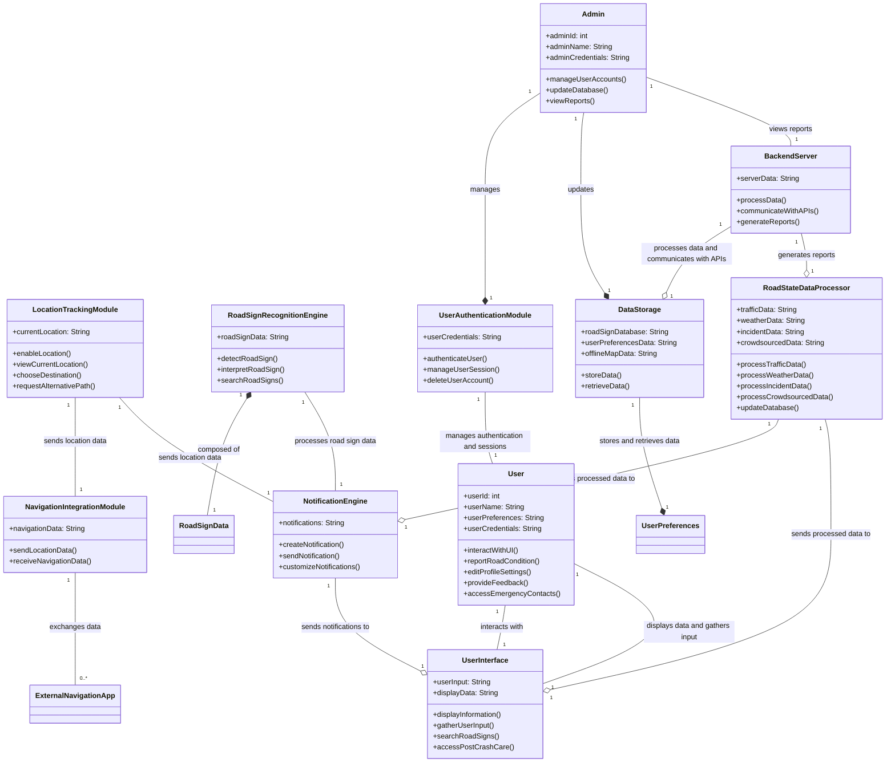

# Class Diagram

```mermaid
classDiagram
    class User {
        +userId: int
        +userName: String
        +userPreferences: String
        +userCredentials: String
        +interactWithUI()
        +reportRoadCondition()
        +editProfileSettings()
        +provideFeedback()
        +accessEmergencyContacts()
    }

    class Admin {
        +adminId: int
        +adminName: String
        +adminCredentials: String
        +manageUserAccounts()
        +updateDatabase()
        +viewReports()
    }

    class LocationTrackingModule {
        +currentLocation: String
        +enableLocation()
        +viewCurrentLocation()
        +chooseDestination()
        +requestAlternativePath()
    }

    class NavigationIntegrationModule {
        +navigationData: String
        +sendLocationData()
        +receiveNavigationData()
    }

    class NotificationEngine {
        +notifications: String
        +createNotification()
        +sendNotification()
        +customizeNotifications()
    }

    class RoadSignRecognitionEngine {
        +roadSignData: String
        +detectRoadSign()
        +interpretRoadSign()
        +searchRoadSigns()
    }

    class RoadStateDataProcessor {
        +trafficData: String
        +weatherData: String
        +incidentData: String
        +crowdsourcedData: String
        +processTrafficData()
        +processWeatherData()
        +processIncidentData()
        +processCrowdsourcedData()
        +updateDatabase()
    }

    class UserInterface {
        +userInput: String
        +displayData: String
        +displayInformation()
        +gatherUserInput()
        +searchRoadSigns()
        +accessPostCrashCare()
    }

    class DataStorage {
        +roadSignDatabase: String
        +userPreferencesData: String
        +offlineMapData: String
        +storeData()
        +retrieveData()
    }

    class UserAuthenticationModule {
        +userCredentials: String
        +authenticateUser()
        +manageUserSession()
        +deleteUserAccount()
    }

    class BackendServer {
        +serverData: String
        +processData()
        +communicateWithAPIs()
        +generateReports()
    }

    %% Relationships
    User "1" -- "1" UserInterface : interacts with
    Admin "1" --* "1" UserAuthenticationModule : manages
    Admin "1" --* "1" DataStorage : updates
    Admin "1" -- "1" BackendServer : views reports
    LocationTrackingModule "1" -- "1" NavigationIntegrationModule : sends location data
    LocationTrackingModule "1" -- "1" NotificationEngine : sends location data
    NavigationIntegrationModule "1" -- "0..*" ExternalNavigationApp : exchanges data
    NotificationEngine "1" --o "1" UserInterface : sends notifications to
    RoadSignRecognitionEngine "1" *-- "1" RoadSignData : composed of
    RoadSignRecognitionEngine "1" -- "1" NotificationEngine : processes road sign data
    RoadStateDataProcessor "1" --o "1" NotificationEngine : sends processed data to
    RoadStateDataProcessor "1" --o "1" UserInterface : sends processed data to
    UserInterface "1" -- "1" User : displays data and gathers input
    DataStorage "1" --* "1" UserPreferences : stores and retrieves data
    UserAuthenticationModule "1" -- "1" User : manages authentication and sessions
    BackendServer "1" --o "1" DataStorage : processes data and communicates with APIs
    BackendServer "1" --o "1" RoadStateDataProcessor : generates reports
```
