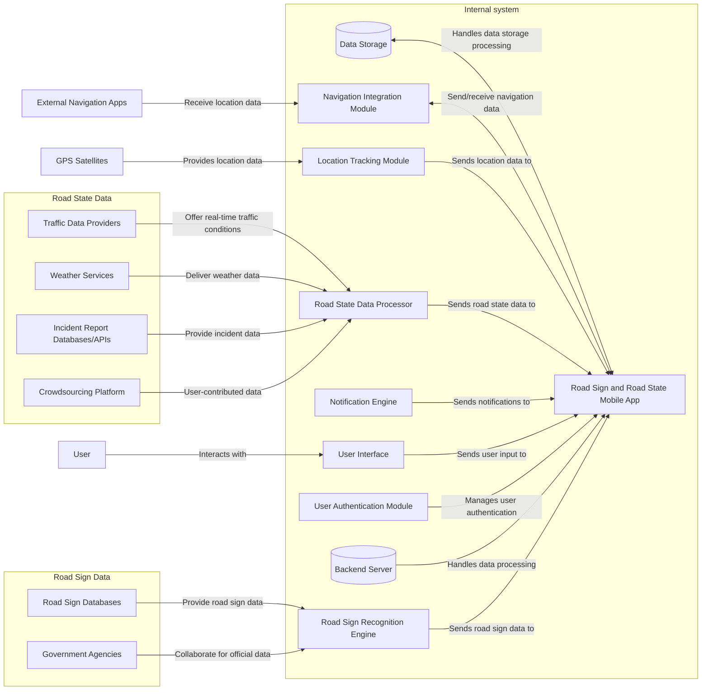

# Context Diagram

```mermaid
graph LR
    subgraph "Internal system"

        LT[Location Tracking Module]
        NIM[Navigation Integration Module]
        NE[Notification Engine]
        RSRE[Road Sign Recognition Engine]
        RSDP[Road State Data Processor]
        UI[User Interface]
        DS[(Data Storage)]
        UAM[User Authentication Module]
        BS[(Backend Server)]
        RSRSA[Road Sign and Road State Mobile App]

    end


    User --"Interacts with" --> UI
    GPS[GPS Satellites] --"Provides location data" --> LT
    ENA[External Navigation Apps] --"Receive location data" --> NIM
    TDP[Traffic Data Providers] --"Offer real-time traffic conditions" --> RSDP
    WS[Weather Services] --"Deliver weather data" --> RSDP
    IRD[Incident Report Databases/APIs] --"Provide incident data" --> RSDP
    RSD[Road Sign Databases] --"Provide road sign data" --> RSRE
    GA[Government Agencies] --"Collaborate for official data" --> RSRE
    CP[Crowdsourcing Platform] --"User-contributed data" --> RSDP


    subgraph "Road State Data"
        TDP[Traffic Data Providers]
        WS[Weather Services]
        IRD[Incident Report Databases/APIs]
        CP[Crowdsourcing Platform]
    end

    subgraph "Road Sign Data"
        RSD[Road Sign Databases]
        GA[Government Agencies]
    end

   DS <-- Handles data storage processing --> RSRSA
   NIM <-- Send/receive navigation data --> RSRSA
   LT -->|Sends location data to| RSRSA
   RSDP -->|Sends road state data to| RSRSA
   NE -->|Sends notifications to| RSRSA
   UI -->|Sends user input to| RSRSA
   UAM -->|Manages user authentication| RSRSA
   BS -->|Handles data processing| RSRSA
   RSRE -->|Sends road sign data to| RSRSA
```
