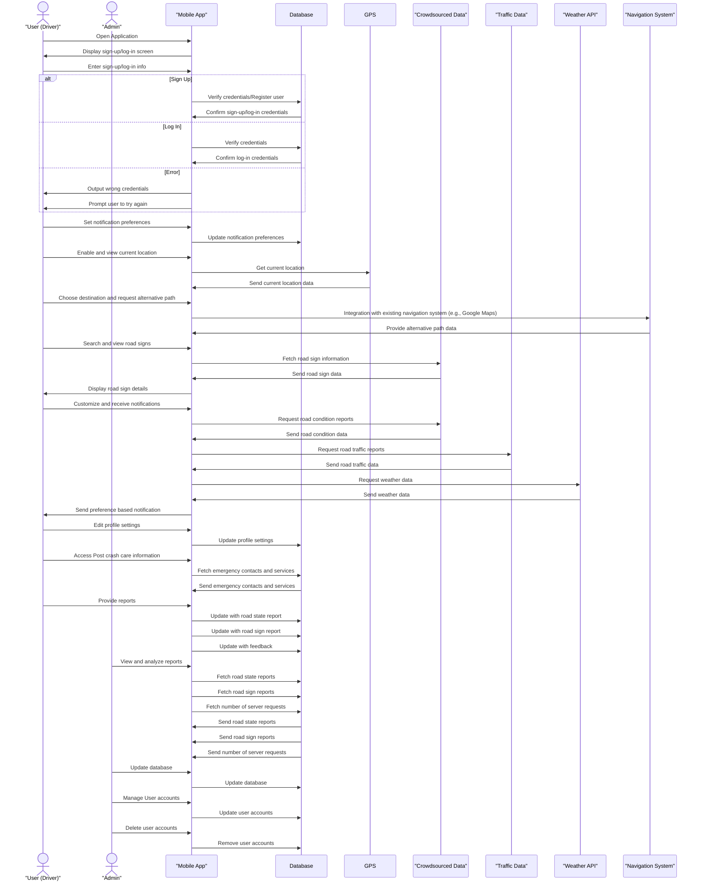

# Sequence Diagram

```mermaid
sequenceDiagram
    actor User as "User (Driver)"
    actor Admin as "Admin"
    participant MobileApp as "Mobile App"
    participant Database
    participant GPS
    participant CrowdsourcedData as "Crowdsourced Data"
    participant TrafficCameras as "Traffic Data"
    participant WeatherSensors as "Weather API"
    participant NavigationSystem as "Navigation System"

    User->>MobileApp: Open Application
    MobileApp->>User: Display sign-up/log-in screen
    User->>MobileApp: Enter sign-up/log-in info

    alt Sign Up
        MobileApp->>Database: Verify credentials/Register user
        Database->>MobileApp: Confirm sign-up/log-in credentials
    else Log In
        MobileApp->>Database: Verify credentials
        Database->>MobileApp: Confirm log-in credentials
    else Error
        MobileApp->>User: Output wrong credentials
        MobileApp->>User: Prompt user to try again
    end

    User->>MobileApp: Set notification preferences
    MobileApp->>Database: Update notification preferences

    User->>MobileApp: Enable and view current location
    MobileApp->>GPS: Get current location
    GPS->>MobileApp: Send current location data

    User->>MobileApp: Choose destination and request alternative path
    MobileApp->>NavigationSystem: Integration with existing navigation system (e.g., Google Maps)
    NavigationSystem->>MobileApp: Provide alternative path data

    User->>MobileApp: Search and view road signs
    MobileApp->>CrowdsourcedData: Fetch road sign information
    CrowdsourcedData->>MobileApp: Send road sign data
    MobileApp->>User: Display road sign details

    User->>MobileApp: Customize and receive notifications
    MobileApp->>CrowdsourcedData: Request road condition reports
    CrowdsourcedData->>MobileApp: Send road condition data
    MobileApp->>TrafficCameras: Request road traffic reports
    TrafficCameras->>MobileApp: Send road traffic data
    MobileApp->>WeatherSensors: Request weather data
    WeatherSensors->>MobileApp: Send weather data
    MobileApp->>User: Send preference based notification

    User->>MobileApp: Edit profile settings
    MobileApp->>Database: Update profile settings

    User->>MobileApp: Access Post crash care information
    MobileApp->>Database: Fetch emergency contacts and services
    Database->>MobileApp: Send emergency contacts and services

    User->>MobileApp: Provide reports
    MobileApp->>Database: Update with road state report
    MobileApp->>Database: Update with road sign report
    MobileApp->>Database: Update with feedback

    Admin->>MobileApp: View and analyze reports
    MobileApp->>Database: Fetch road state reports
    MobileApp->>Database: Fetch road sign reports
    MobileApp->>Database: Fetch number of server requests
    Database->>MobileApp: Send road state reports
    Database->>MobileApp: Send road sign reports
    Database->>MobileApp: Send number of server requests

    Admin->>MobileApp: Update database
    MobileApp->>Database: Update database
    Admin->>MobileApp: Manage User accounts
    MobileApp->>Database: Update user accounts
    Admin->>MobileApp: Delete user accounts
    MobileApp->>Database: Remove user accounts

```
